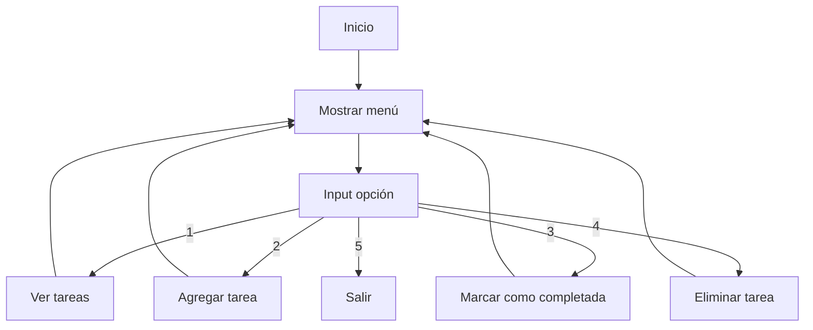

# Administrador de Tareas - Proyecto 1

## ✨ Objetivo

Desarrollar una aplicación de consola que administre tareas, usando diccionarios para gestionar el estado (pendiente o completada) de cada tarea, reforzando el uso de estructuras de datos y control de flujo en Python, además de prácticas de control de versiones con Git y GitHub.

---

## 📅 Actividades realizadas

### 1. Inicialización del proyecto

* Diseño del menú interactivo con `while` e `if`.
* Separación en funciones: ver, agregar, marcar completada, eliminar.

### 2. Configuración de Git y GitHub con SSH

* Creación del repositorio local y conexión segura con GitHub.
* Manejo de llaves SSH y del flujo `git add`, `commit`, `push`, `pull`.

### 3. Migración del manejo de tareas

* De listas separadas (`tareas` y `completadas`) a un único **diccionario**:

  ```python
  tareas = {
    "hacer ejercicio": "pendiente",
    "leer libro": "Completada"
  }
  ```
* Esto permite asociar cada tarea directamente con su estado.
* Implementación de `del` para eliminar claves y actualización directa para marcar como completada.

---

## 🔄 Diagrama de flujo



---

## 📝 Conceptos principales

### Python

| Concepto            | Uso en el proyecto                       |
| ------------------- | ---------------------------------------- |
| Diccionarios        | Para asociar tarea → estado              |
| `append` / `remove` | (inicialmente con listas, luego migrado) |
| `del`               | Para eliminar entradas del diccionario   |
| `input`, `print`    | Interacción por consola                  |
| `while`, `if`       | Flujo de control del menú                |
| Funciones           | Separación lógica de las acciones        |

### Git / GitHub

| Comando                 | Función                         |
| ----------------------- | ------------------------------- |
| `git init`              | Crear repo local                |
| `git add .`             | Preparar cambios                |
| `git commit -m`         | Guardar snapshot del proyecto   |
| `git push`, `git pull`  | Sincronizar con GitHub          |
| `ssh-keygen`, `ssh-add` | Autenticación segura con GitHub |

---

## ✅ Estado actual

*

---

## 🚀 Próximos pasos

* Mejorar presentación en consola (por ejemplo, con emojis ✅ ⏳).
* Guardar y cargar el estado de las tareas desde un archivo.
* Refactorizar el código para que sea más modular y escalable.
* Agregar pequeños tests automáticos para validar el flujo.

